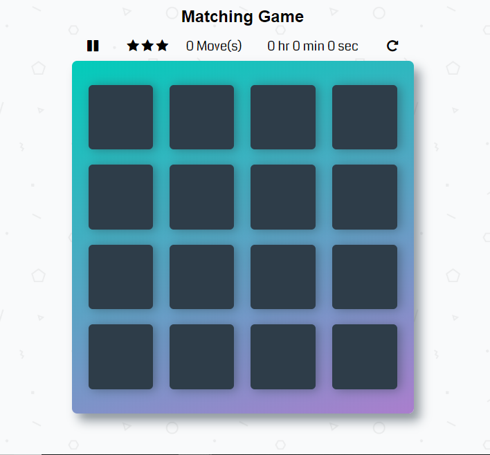

# Memory Game Project

A simple Memory Game Project for Udacity's Front-end development [nanodegree program](https://www.udacity.com). The Memory Game Project is all about demonstrating the mastery of JavaScript. This project is a complete browser-based card matching game. This project also includes some CSS involved in the display of the webpage.  

--------------------------------------------------------------------------------------------------------------------------

## Table of Contents

* [Download](#download)
* [Instructions](#instructions)
* [What's included](#whats-included)
* [Steps followed](#steps-followed)
* [How to play](#how-to-play)
* [Game functionality](#game-functionality)
* [Benefits of Memory Game Project](#benefits-of-memory-game-project)
* [Tools used](#tools-used)
* [Contributing](#contributing)

--------------------------------------------------------------------------------------------------------------------------

## Download

- The starter code for the project can be downloaded from:

     1. Memory Game project repository on GitHUB : <https://github.com/udacity/fend-project-memory-game>
      
     2. The Zipped File : <https://github.com/udacity/fend-project-memory-game/archive/master.zip>

- Download from any of the given sources Now Extract the folder.

- The starter code has a static, non-interactive version of the project so we can get a jump-start on development.

--------------------------------------------------------------------------------------------------------------------------

## Instructions

- The starter project has some HTML and CSS styling to display a static version of the Memory Game project.

- This project is converted from a static project to an interactive one.

- This requires modifying the HTML and CSS files, but primarily the JavaScript file.

- To get started, open `js/app.js` and start building out the app's functionality.

- Before moving forward, make sure you are comfortable with the content from [JavaScript and the DOM](https://classroom.udacity.com/courses/ud117).

- For specific, detailed instructions, look at the project instructions in the [Udacity Classroom](https://classroom.udacity.com/me).

--------------------------------------------------------------------------------------------------------------------------

## What's included

- Within the download you'll find the following directories and files:

```
fend-project-memory-game-master.zip
-->css/
    -->app.css
-->img/
    -->cong.png
    -->geometry2.png
    -->Matching_game.png
    -->play.png
    -->restart.png
-->js/
    -->app.js
-->.gitattributes
-->.gitignore
-->CONTRIBUTING.md
-->README.md

```

--------------------------------------------------------------------------------------------------------------------------

## Steps followed

- First download the scratch project from the specified links.

- Extract the zip file.

- The extracted folder consists some directories and files. For more details check [What's included](#what's include).

- The static view of this project is converted to an interactive view.

- On loading the game, the cards should be shuffled. Shuffle function from <http://stackoverflow.com/a/2450976>.

- For this project, we will be writing most of our code in `js/app.js`.

- In app.js, initially the references of all cards from the deck are stored in an array *myCards*. And listeners are added to each card using for-each.

- The timer was started on the first click on card.

- On clicking a card , the underlying symbol is be made visible by adding `*open*` and `*show*` classes.

- Since, the comparison is between two cards the card references are stored in an array named *openedCards*.

- The class names of the cards in this array are compared.

- If the symbols are matched, the cards are made to be remained open.

- If the symbols are not matched, the cards are flipped.

- For each matched move the move counter `matchedCnt` is incremented by 1.

- If the `matchedCnt` is equal to 8 i.e., all cards are matched, a popup is displayed.

- The popup contains *Total Time* taken , star *Rating* , *No. of moves* made and *Restart*.

- The star ratings depends on no. of moves made.

--------------------------------------------------------------------------------------------------------------------------

## How to play
- The static view of *Memory Game Project* is:

  

- The game board consists of sixteen "cards" arranged in a grid.

- The deck is made up of eight different pairs of cards, each with different symbols on one side.

- The cards are arranged randomly on the grid with the symbol face down.

- The gameplay *rules* are very simple: flip over two hidden cards at a time to locate the ones that match!

- Each turn:
	   --> The `player` flips one card over to reveal its underlying symbol.
	   --> The `player` then turns over a second card, trying to find the corresponding card with the same symbol.
     --> If the cards match, both cards stay flipped over.
     --> If the cards do not match, both cards are flipped face down.

- The game ends once all cards have been correctly matched.

--------------------------------------------------------------------------------------------------------------------------

## Game functionality

- The real-life game, players flip over cards to locate the pairs that match The goal is to recreate this effect in the project.

- There are a couple of interactions that are handled:

#### Flipping cards:
      - The cards are flipped horizontally.
#### A Correct Guess (When cards match):
      - The cards are flipped open and made wobble.
#### An Incorrect Guess (When cards do not match):
      - The cards are flipped over and made wobble.
#### Pause and Restart
      - The game can be paused by clicking pause icon or using a Keyboard shortcut `*Shift+P*`.
      - The game can be restarted by clicking restart icon or using a keyboard shortcut `*Shift+R*` .
#### Winning The Game
      - A popup is displayed with No. of moves, star rating and Time taken.

--------------------------------------------------------------------------------------------------------------------------

## Benefits of Memory Game Project

```
  * This game presents the first opportunity to fully combine the skills in HTML, CSS, and JavaScript into a large project.
  * Helps To Boost The Brain.
  * Improves concentration.
  * Enhance Visual Discrimination.
  * Improves Creativity.
  * Enhance Power Of Recognition.
  * Increase attention to detail.

```

--------------------------------------------------------------------------------------------------------------------------

## Tools used

- [Fontawesome](https://fontawesome.com/icons?from=io) was used to display game card's icons.

--------------------------------------------------------------------------------------------------------------------------

## Contributing

- This repository is the starter code for _all_ candidates who are interested in basic JavaScript.

- For details, check out [CONTRIBUTING.md](CONTRIBUTING.md).
